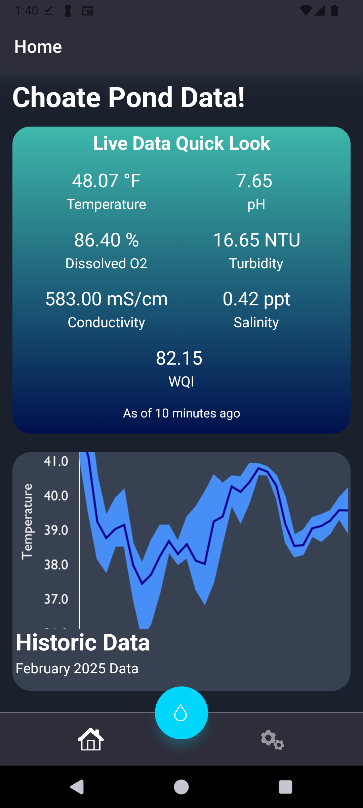
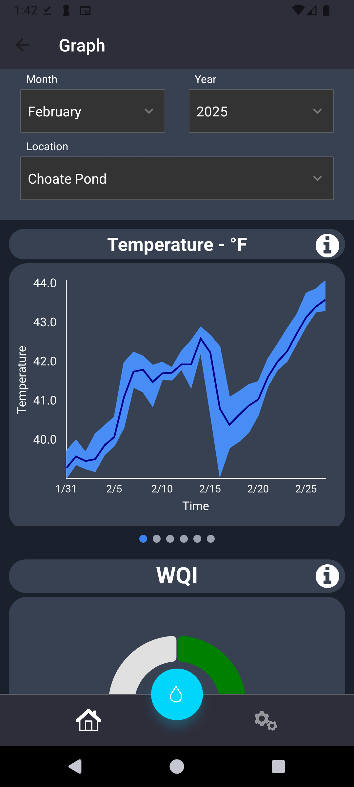
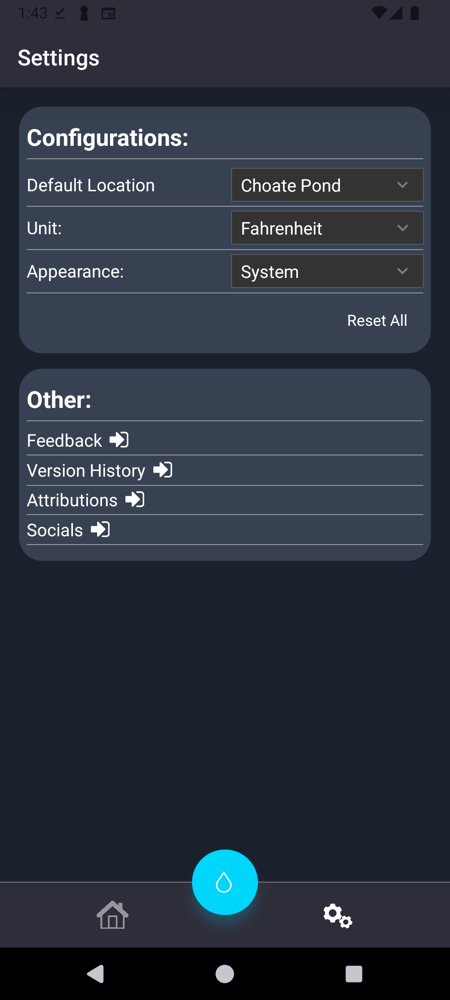

# AquaWatch Mobile App

 
 

 

<h2>Bringing water quality to your finger tips!</h2>
Repo for AquaWatch Mobile app

### About the Project

Knowing what's in your water - is a human right. The AquaWatch Mobile App bring water data right to your finger tips. While the current scope of the app is limited to pond and river data, we hope to set an example for what's possible.

One day you'll know what's in the water that's coming out of your tap.

#### Features

-   Informative data visualization of water quality metrics.
-   Monthly water quality reports with graphical representations.
-   Information about local wildlife and its dependence on water quality.
-   Access to Blue CoLab blogs.

### Repo Structure

-   [`.github`](./.github/) The files for workflows for GitHub Actions and the pull request template.
-   [`.vscode](./.vscode/) The files to configure VS Code setting such that all developers share common settings
-   [`aquawatch_mobile_app](./aquawatch_mobile_app/) Source code for tbe app
-   [`website](./website/) Source code for privacy policy of app

### Getting Started

To get started, please see [here](./aquawatch_mobile_app/README.md)

### Wiki (technical breakdown)

For a technical info see our [wiki](https://github.com/bluecolab/BlueColab_MobileDataViz/wiki/).

### Development Team

The members of the team include:

-   Alex Chen ([ln/yan-yu-chen-3474a71aa](https://www.linkedin.com/in/yan-yu-chen-3474a71aa/)) of Blue Shield
-   Nicholas Davila ([ln/nicholas--davila](https://www.linkedin.com/in/nicholas--davila/)) of Blue Shield
-   Noor Ul Huda ([ln/noorulhuda92](https://www.linkedin.com/in/noorulhuda92/)) of Blue CoLab
-   Lizi Imedashvilli ([ln/lizi-imedashvili-2b3a6b249](https://www.linkedin.com/in/lizi-imedashvili-2b3a6b249/)) of Data Divas
-   Ardin Kraja ([ln/ardin-kraja-19ab61230](https://www.linkedin.com/in/ardin-kraja-19ab61230/)) of Blue Jelly
-   Victor Lima ([ln/victor--lima](https://www.linkedin.com/in/victor--lima/)) of Data Divas
-   Charles Metayer ([ln/charles-metayer-jr-9a983b267](https://www.linkedin.com/in/charles-metayer-jr-9a983b267/)) of Blue Shield
-   Meryl Mizell ([ln/meryl-mizell](https://www.linkedin.com/in/meryl-mizell/)) of Blue Jelly
-   Lulu Moquette ([ln/louisamoquete](https://www.linkedin.com/in/louisamoquete/)) of Blue Jelly
-   Kenji Okura ([ln/kenji-okura](https://www.linkedin.com/in/kenji-okura/)) of Blue Jelly
-   Michael Rourke ([ln/michael-rourke-532b32225](https://www.linkedin.com/in/michael-rourke-532b32225/)) of Blue Shield
-   Erin Sorbella ([ln/erin-sorbella-40936b241](https://www.linkedin.com/in/erin-sorbella-40936b241/)) of Blue Jelly

\*\*### Screenshots

**
